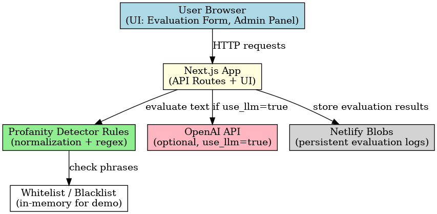

# Profanity Detection System

A comprehensive profanity detection system built with Next.js, featuring intelligent text analysis, customizable word lists, and detailed logging capabilities.

## Features

- **Text Analysis**: Real-time profanity detection with severity scoring
- **Smart Masking**: Intelligent text masking preserving readability
- **Admin Panel**: Full CRUD operations for blacklist and whitelist management
- **Evaluation History**: Complete logging of all text evaluations
- **LLM Integration**: Toggle for enhanced AI-powered validation
- **Responsive Design**: Works seamlessly across all devices
- **Unit Tests**: Validation of normalization and key detection logic

## Tech Stack

- **Frontend**: Next.js 13+ with TypeScript
- **UI Components**: shadcn/ui with Tailwind CSS
- **LLM**: OpenAI API
- **Database**: In-memory storage (easily replaceable with Supabase/PostgreSQL)
- **Icons**: Lucide React
- **Testing**: Jest with ts-jest

## Getting Started

### Prerequisites

- Node.js 18+ 
- npm or yarn

### Installation

1. Clone the repository
```bash
git clone <repository-url>
cd profanity-detection-system
```

2. Install dependencies
```bash
npm install
```

3. Start the development server
```bash
npm run dev
```

4. Open [http://localhost:3000](http://localhost:3000) in your browser

## API Routes

### Evaluate Text
**POST** `/api/evaluate`

Request body:
```json
{
  "text": "Your text to analyze",
  "use_llm": true
}
```

Response:
```json
{
  "contains_profanity": true,
  "severity": 2,
  "masked_text": "Your text to ana***e",
  "matches": [
    {
      "word": "analyze",
      "severity": 2
    }
  ]
}
```

### Admin API Routes

- **GET** `/api/admin/blacklist` - Get all blacklist words
- **POST** `/api/admin/blacklist` - Add new blacklist word
- **DELETE** `/api/admin/blacklist/[id]` - Delete blacklist word

- **GET** `/api/admin/whitelist` - Get all whitelist words  
- **POST** `/api/admin/whitelist` - Add new whitelist word
- **DELETE** `/api/admin/whitelist/[id]` - Delete whitelist word

- **GET** `/api/admin/logs` - Get evaluation history

## Project Structure

```
├── app/
│   ├── page.tsx              # Main evaluation interface
│   ├── admin/
│   │   └── page.tsx          # Admin panel for word management
│   ├── history/
│   │   └── page.tsx          # Evaluation history viewer
│   └── api/
│       ├── evaluate/
│       │   └── route.ts      # Text evaluation endpoint
│       └── admin/
│           ├── blacklist/    # Blacklist management
│           ├── whitelist/    # Whitelist management
│           └── logs/         # Evaluation logs
├── lib/
│   ├── profanity-detector.ts # Core detection logic
│   └── database.ts          # Database operations
├──__tests__/              # Unit tests
└── components/ui/           # shadcn/ui components
```

## Text Normalization

The system includes sophisticated text normalization:

- **Accent Removal**: Removes diacritics and accents
- **Leetspeak Conversion**: Converts common substitutions (4→a, 3→e, etc.)
- **Special Character Handling**: Removes punctuation while preserving spaces
- **Case Normalization**: Converts to lowercase for consistent matching

## Severity Levels

- **Level 1 (Mild)**: Minor inappropriate language
- **Level 2 (Moderate)**: Moderately offensive content
- **Level 3 (Severe)**: Highly offensive or explicit content

## Deployment

### Build for Production

```bash
npm run build
```

### Deploy to Netlify

This project is configured to run on Netlify. Push your repository and connect it to Netlify for automatic deploys.
Demo URL: https://leafy-gecko-141acf.netlify.app


## Environment Variables

Create a `.env.local` file with:

```env
# Optional: OpenAI API key for LLM validation
OPENAI_API_KEY=your_openai_api_key_here
```

## Testing

Run the test suite with:

```bash
npm test
```
Unit tests cover:
- Normalization of leetspeak and accented characters
- Detection of blacklist words with severity
- Respect for whitelist words

### Architecture Diagram


### Postman Collection
Puedes importar la colección incluida en el repo:
[profanity-detection.postman_collection.json](./profanity-detection.postman_collection.json)

## CURL Examples

```bash
## CURL Examples

# -----------------------------
# Evaluate text
# -----------------------------
curl -X POST https://leafy-gecko-141acf.netlify.app/api/evaluate \
  -H "Content-Type: application/json" \
  -d '{"text": "This is some damn good text", "use_llm": false}'

# -----------------------------
# Blacklist
# -----------------------------

# Get blacklist
curl https://leafy-gecko-141acf.netlify.app/api/admin/blacklist

# Add to blacklist
curl -X POST https://leafy-gecko-141acf.netlify.app/api/admin/blacklist \
  -H "Content-Type: application/json" \
  -d '{"phrase": "badword", "severity": 2}'

# Update blacklist word (ej: id=3)
curl -X PUT https://leafy-gecko-141acf.netlify.app/api/admin/blacklist/3 \
  -H "Content-Type: application/json" \
  -d '{"phrase": "updatedword", "severity": 1}'

# Delete blacklist word (ej: id=3)
curl -X DELETE https://leafy-gecko-141acf.netlify.app/api/admin/blacklist/3

# -----------------------------
# Whitelist
# -----------------------------

# Get whitelist
curl https://leafy-gecko-141acf.netlify.app/api/admin/whitelist

# Add to whitelist
curl -X POST https://leafy-gecko-141acf.netlify.app/api/admin/whitelist \
  -H "Content-Type: application/json" \
  -d '{"phrase": "goodword"}'

# Update whitelist word (ej: id=2)
curl -X PUT https://leafy-gecko-141acf.netlify.app/api/admin/whitelist/2 \
  -H "Content-Type: application/json" \
  -d '{"phrase": "updatedgood"}'

# Delete whitelist word (ej: id=2)
curl -X DELETE https://leafy-gecko-141acf.netlify.app/api/admin/whitelist/2

# -----------------------------
# Logs
# -----------------------------

# Get evaluation logs
curl https://leafy-gecko-141acf.netlify.app/api/admin/logs
```

## Contributing

1. Fork the repository
2. Create a feature branch
3. Make your changes
4. Add tests if applicable
5. Submit a pull request
